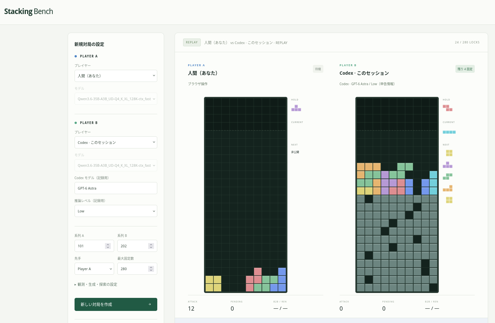

Vibe coded & Works on my machine.

# StackingBench

LLM の盤面理解、先読み、攻防判断を比較・記録するローカル対戦ベンチマーク。SRS の到達可能な配置から1個ずつ選択し、7固定ごとに交代します。初期仕様は [docs/rules.md](docs/rules.md)、開発方針は [AGENTS.md](AGENTS.md) にあります。



## 起動

Node.js 22.8以上（検証環境は24.14）。外部パッケージのインストールは不要です。

```bash
pnpm start
```

[http://127.0.0.1:3210](http://127.0.0.1:3210) を開き、プレイヤーを選び「新しい対局を作成」→「1手進める」または「自動対戦」を押します。初期状態は探索 bot 同士なので、LLM サーバーなしでもすぐに動かせます。

他のアプリが3000番を使用していたため、初期ポートは 3210 です。サーバーは 127.0.0.1 にだけバインドします。

## プレイヤーと対戦相手

StackingBench では以下のプレイヤー種別を自由に組み合わせて対戦・比較できます。

| プレイヤー種別 | 種別名 | 説明 |
|---|---|---|
| 探索 bot | `search` | 同じ状態遷移と公開情報を使う固定評価の best-first 探索。初期の基準線（ベースライン）。 |
| 人間（手動操作） | `human` | ブラウザのキーやボタンで操作し、同じ SRS と状態遷移で固定。 |
| LLM（試し読みなし） | `llm` | 全24行の文字盤面と順位のない合法手ID一覧から1手を選択。 |
| LLM（試し読みあり） | `llm-preview` | 公開観測に加え、遷移予算内で仮置きツール（試し読み）を使用可能。 |
| Codex セッション | `codex` | 既存の Codex セッションから専用 CLI 経由で公開観測・試し読み・手を送受信。 |
| Antigravity CLI | `agy` | 既存の Antigravity CLI (agy) セッションから専用 CLI 経由で対戦。 |

### 自分で対戦する（人間）

プレイヤー A または B を「人間（あなた）」、相手を LLM（試し読みの有無を選択）または探索 bot にして「新しい対局を作成」を押します。相手が先手なら自動で開始し、自分の番になると入力待ちになります。7個固定すると相手が自動で7個置きます。

盤面をクリックしてキー操作するか、盤面下のボタンを使います。

|操作|キー|
|---|---|
|左右・1マス下へ移動|← / → / ↓|
|左90度回転|Z|
|右90度回転|X / ↑|
|HOLD 切替|C|
|着地点まで落として固定|Space|
|現在のミノの操作をやり直し|R|

枠で着地点を表示します。重力・操作時間制限はありません。HOLD とやり直しは固定前の操作だけに作用し、確定した盤面は戻しません。リプレイに戻っている間は操作できず「最新の局面へ」で再開します。同じブラウザタブを再読み込みしても、サーバーが動いていれば対局を復元します（未確定の操作はスポーンからやり直し）。サーバー再起動後は保存リプレイの局面から新しい対局として分岐できます。

人間の対局も種別・操作経路・HOLD・盤面・結果を保存します。人間の判断時間は入力待ちを含むサーバー側の経過時間、API・token・試し読み遷移数は0です。人間参加の有無とモデル条件は別に記録されます。

### LLM プロバイダの接続

LLM プレイヤー（`llm` / `llm-preview`）は、ローカル推論サーバーや外部 API に接続できます。

- **ローカル / OpenAI 互換サーバー (llama.cpp など)**
  既定の接続先は `http://localhost:8082` です。変更する場合:
  ```bash
  LLM_BASE_URL=http://localhost:8082 PORT=3210 pnpm start
  ```
  モデルを指定した生成要求でロードする構成を実機確認済みです（モデル一覧の取得だけでは生成能力を確認できません）。

- **さくらのAI Engine**
  `preview/Kimi-K2.6` や `preview/gemma-4-31B-it` に接続できます。環境変数 `SAKURA_AI_API_KEY` を設定してください。接続設定や実験手順は [docs/sakura.md](docs/sakura.md) を参照してください。

- **TypeSafe Jev**
  TypeSafe の Jev Choice プリミティブを用いた合法手選択に対応しています。環境変数 `TYPESAFE_API_KEY` を設定し、プレイヤーを「LLM · 試し読みなし」、モデルを「TypeSafe · Jev」に設定してください。接続仕様は [docs/typesafe.md](docs/typesafe.md) を参照してください。

### コーディングエージェント セッションとの対戦

チャットやコーディングエージェントの会話セッション自体を対戦相手にできます。専用コマンド `scripts/agent.js` を介して公開観測を取得し、手を送信します。ブラウザからセッションを自動起動する機能はありません。

- **Codex セッション**: 相手を「Codex · このセッション」にし、画面に表示される対局ID付きの依頼を Codex の会話に伝えます。試し読み切替可能（既定32遷移）、モデル名・推論レベルも記録されます。詳細は [docs/codex-player.md](docs/codex-player.md) を参照してください。
- **Antigravity CLI (agy)**: 相手を「Antigravity CLI (agy)」にし、対局作成後に「対戦依頼をコピー」して agy の会話に貼り付けます。記録用モデル名を設定可能。詳細は [docs/agy-player.md](docs/agy-player.md) を参照してください。

## 主な機能

- **観測と情報境界**:
  - 全24行の文字盤面、公開 NEXT 5、自他の B2B / REN、保留ミノなどを提供。
  - 公開情報境界を厳密に管理。ライブ画面への応答や LLM 観測、試し読み用コピーからは、相手の current/NEXT、seed、乱数状態、bag、未来のおじゃま穴を完全に除外します。未来のおじゃま穴が必要な遷移は停止し、仮の穴を正解として返しません。
  - 観測設定はプレイヤー種別と独立しています。初期版の LLM は文字のみ（画像・両方は明示的に未実装）。探索 bot は表示エンコーディングを使用しません。人間の画面には固定セルを色付きで描き、LLM にはセル文字と座標を渡します。
- **リプレイと局面分岐比較**:
  - すべての対局を JSONL で保存し、スライダーによる巻き戻し再生や移動・回転経路の確認が可能。
  - リプレイ閲覧中に左のプレイヤー設定を変更し、「この局面で比較」を押すことで同一局面から別モデルや別条件で分岐実行できます（メモはリセット）。
- **対局メトリクスと可視化**:
  - 両者の盤面、予告、攻撃送信 / 相殺 / 受信量、消去行数、Gセル・G行消去、固定数、火力/固定、掘り効率、判断理由、作戦メモ、時間、token使用量、試し読み遷移数を表示・記録。

## 実験コマンド

```bash
# モデル一覧、短い構造化応答、思考出力の保存
pnpm run probe -- Gemma-4-E2B_UD_Q4_K_XL_fast

# 探索 bot 同士、3シード、先後交換（6対局）
pnpm run bench -- --seeds 101,202,303 --swap

# 軽量モデルの短い接続確認（強さの評価には使用しない）
pnpm run bench -- --a llm-preview --b search --model Gemma-4-E2B_UD_Q4_K_XL_fast --max-locks 14

# 通常モデル、思考無効を明示した別条件
pnpm run bench -- --a llm-preview --b llm --model Qwen3.6-35B-A3B_UD-Q4_K_XL_128K-ctx_fast --thinking off --max-locks 14

# 空の同一局面を3条件で各1判断（対局成績には含めない）
pnpm run compare -- --model Qwen3.6-35B-A3B_UD-Q4_K_XL_128K-ctx_fast --thinking off

# 保存した局面を使う（RUN_ID は拡張子なし、index=0 は開始時）
pnpm run compare -- --run RUN_ID --index 14 --model MODEL_ID --thinking off
pnpm run replay -- RUN_ID

pnpm test
pnpm run check
```

生成上限2048は**応答ごと**、全判断の生成予算8192、最大34往復、応答待ち120秒が初期値です。試し読み予算は1判断32遷移。UI の詳細設定で変更できます。CLI は `--max-tokens` / `--transitions` も利用できます。`--thinking off` は `chat_template_kwargs.enable_thinking=false` を送ります。既定設定と混ぜず、別条件として集計してください。

初回の Qwen 検証では、サーバー既定の思考設定で2応答とも2048tokenに到達し、本文が空のまま打切られました。最初の接続確認には、明示的な思考無効設定か、用途に合わせた出力予算の見直しが必要です。詳細と実測値は [docs/validation.md](docs/validation.md) に保存します。

モデルIDの切替によるルーティングを利用し、同一対局内でも両者別のIDを設定できます。ただし異モデル同士の直接対戦は実測していません。ロード待ちやVRAMの影響を受けるため、初期の比較は同一モデルごとの逐次実行を推奨します。UI内の対局は同時実行を拒否します。CLI は別プロセスなので、UIや別CLIの生成と重ねない運用にしてください。

## ログと再現性

`runs/` に対局JSONL、probe・batch・position比較JSONが保存されます。Git対象外です。対局JSONLはheader、decision、endの順に追記。各decisionは設定済みプロンプト、要求/応答、usage、試し読み履歴、選択ID、操作列、盤面、ハッシュ、説明・メモ、時間とエラーを保存します。headerにルール、seed、完全な初期状態、ソースハッシュと取得できたGitリビジョンを保存します。

通信障害・timeoutは無効、不正出力は1回だけ再試行し再失敗で失格。無断のbot代替はありません。停止は進行中の判断を待って aborted として保存します。プロセスが突然終了した場合は最後に保存できた判断まで復元でき、末尾の書きかけ行は読み飛ばします。**進行中の未完了判断の応答は保証されません**。

自他のミノ列、おじゃま乱数、HOLD消費まで状態に含まれます。完全ログは人間の再現用であり、LLMに渡す観測は別に生成します。試し読み用コピーからは非公開系列と乱数状態を除去。未来のおじゃま穴が必要な遷移は停止し、仮の穴を正解として返しません。

送信/相殺/受信、消去、Gセル・G行消去、固定数、火力/固定、掘り効率、時間、API回数、token、遷移、失格/無効を記録。費用と不明なusageはnullです。同じ32遷移でも計算量が同じとは言えません。固定botの初期評価は弱い基準線であり、最適化された競技botではありません。

## 構成

|場所|責務|
|---|---|
|`src/engine.js`|ルール、SRS、合法手列挙、決定的状態遷移|
|`src/observation.js`|公開観測と既知情報だけの試し読み|
|`src/players.js`|共通プレイヤー接続口、評価探索、LLMプロトコルと予算|
|`src/providers.js`|接続先・認証・秘密情報の除外・公開レートに基づく費用推定|
|`src/probe.js`|対局と分離した生成の疎通確認|
|`src/agent.js`|Codex / agy セッション用の公開観測・試し読み予算・選択JSON検証|
|`src/match.js`|対局進行、JSONL保存、集計|
|`src/server.js`|ローカルHTTP APIと画面配信|
|`web/`|対戦・リプレイ画面。描画にエンジンのセル形状・操作を共有|
|`scripts/`|比較・疎通・再計算・任意のブラウザ検証|
|`test/`|回転、消去、相殺、情報境界、障害、永続化の回帰テスト|

HTTPの主な接続口は `GET /api/config`, `GET /api/models`, `POST /api/matches`, `POST /api/matches/:id/step|run|stop`, `GET /api/matches/:id`, `GET /api/runs`, `GET /api/runs/:id`。操作APIは非同期で202を返し、状態をポーリングします。任意のコマンド実行や任意のファイル読取りAPIはありません。

大規模バッチ、画像入力、all-spin、操作列の直接生成は今回の範囲に含めていません。まずルールv1とプロンプトを固定して複数seed・先後交換で測定し、失格率や予算条件も併記する段階です。
